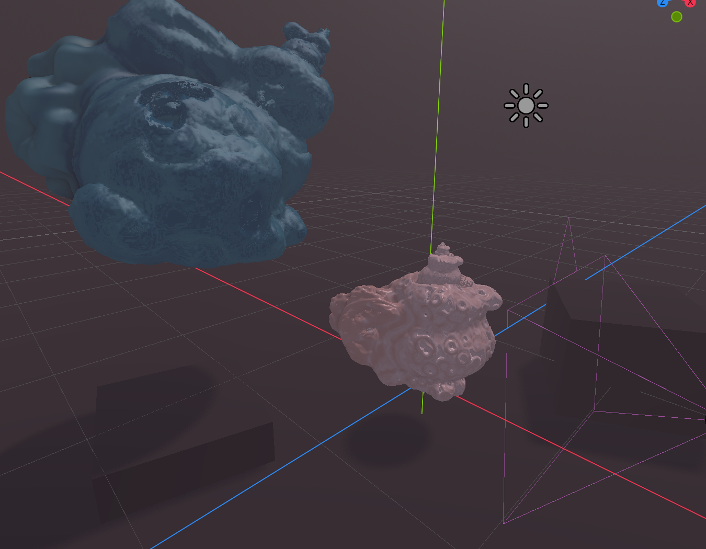

# gd-fractals
Dynamic 3D fractals rendered using a raymarching shader in Godot 4. Includes seamless integration with Godot's default 3D editor and a plugin to convert `.obj` meshes into signed distance function textures.

## References
- [Into the Portal: Directable Fractal Self-Similarity](https://doi.org/10.1145/3641519.3657466)
- [A Shape Modulus for Fractal Geometry Generation](https://doi.org/10.1111/cgf.14905) 
- [Distance Estimated 3D Fractals (III): Folding Space](http://blog.hvidtfeldts.net/index.php/2011/08/distance-estimated-3d-fractals-iii-folding-space/)
- [Distance Estimated 3D Fractals (V): The Mandelbulb & Different DE Approximations](http://blog.hvidtfeldts.net/index.php/2011/09/distance-estimated-3d-fractals-v-the-mandelbulb-different-de-approximations/)
- [Distance Estimated 3D Fractals (VI): The Mandelbox](http://blog.hvidtfeldts.net/index.php/2011/11/distance-estimated-3d-fractals-vi-the-mandelbox/)
- [Revenge of the (Half-Eaten) Menger Sponge](http://www.fractalforums.com/ifs-iterated-function-systems/revenge-of-the-half-eaten-menger-sponge/15/)
- [Inigo Quilez's Signed Distance Functions](https://iquilezles.org/articles/distfunctions/)