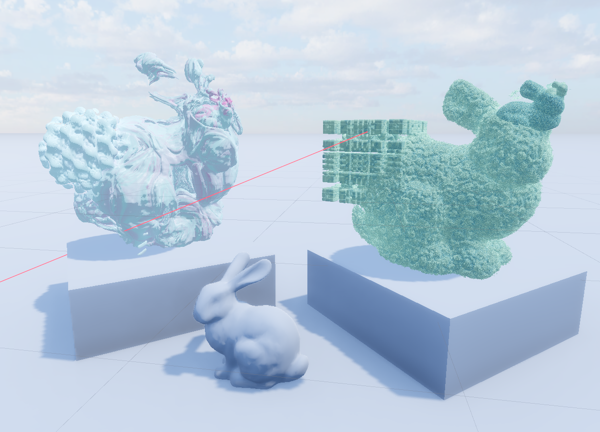
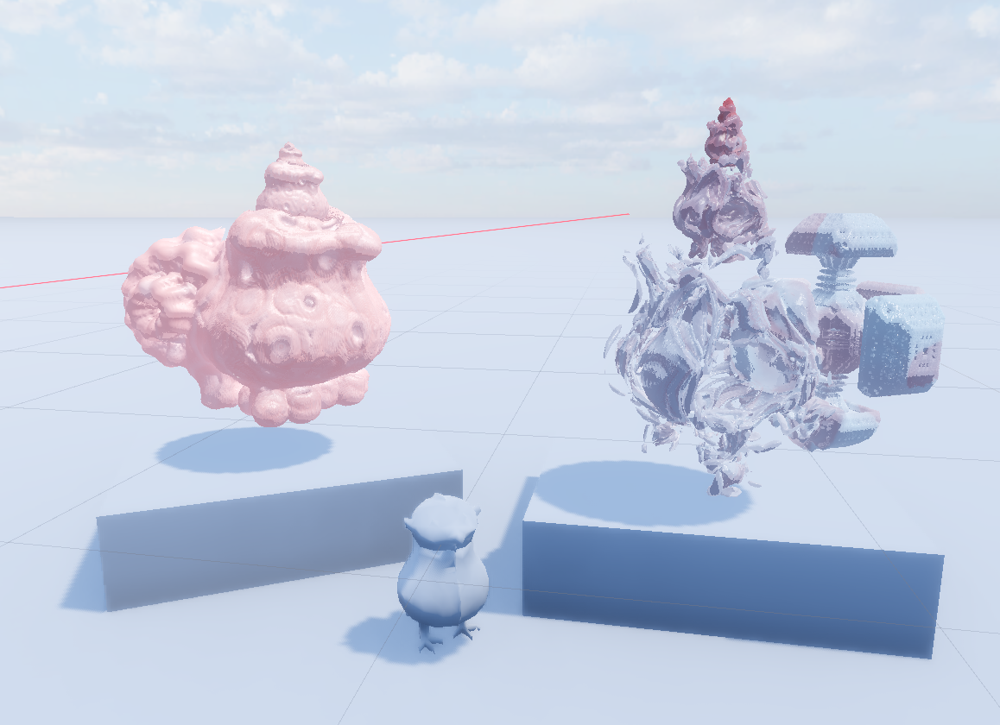

# gd-fractals
Dynamic 3D mesh fractals rendered using a raymarching shader in Godot 4. Includes seamless integration with Godot's default 3D editor and a plugin to convert `.obj` meshes into signed distance function textures. See demo project for example usage.

## Usage
1. Create a `MeshInstance3D` and attach a `QuadMesh` to it with `orientation` set to `Face Z`.
2. Set `cast_shadow` to off. If you want an approximation of shadows, you can add a second `MeshInstance3D` as a child with `cast_shadow` set to `Shadows Only` -- a sphere mesh works okay to give visual depth at least.
3. Create a `ShaderMaterial` and attach either `rendering/raymarcher.gdshader` or `rendering/raymarcher_simple.gd_shader`. The normal variant allows you to merge mesh fractals with a secondary fractal, while the simple variant allows you to render the secondary fractals by themselves. 
4. Configure the parameters. See examples in `demo` for reasonable values.

## SDF Converter
The mesh fractal shader takes as input the 3D signed distance function texture of a model rather than a triangulated mesh. The SDF converter addon in this repository allows you to convert `.obj` files into the correct format directly. It uses a Python script, so ensure that you've installed the libraries in `addons/sdf_converter/requirements.txt`. A size of at least 64 is recommended, but 256 produces good results.

## References
I have a small write-up of this project [here](https://docs.google.com/document/d/1ecygfTbzJsfupnbxuLFPNrYEHTBqLmuRNlqzfNGl41A/edit?usp=sharing) if you want more details. Below are references for the fractal logic and some distance estimates that I used.
- [Into the Portal: Directable Fractal Self-Similarity](https://doi.org/10.1145/3641519.3657466)
- [A Shape Modulus for Fractal Geometry Generation](https://doi.org/10.1111/cgf.14905) 
- [Distance Estimated 3D Fractals (III): Folding Space](http://blog.hvidtfeldts.net/index.php/2011/08/distance-estimated-3d-fractals-iii-folding-space/)
- [Distance Estimated 3D Fractals (V): The Mandelbulb & Different DE Approximations](http://blog.hvidtfeldts.net/index.php/2011/09/distance-estimated-3d-fractals-v-the-mandelbulb-different-de-approximations/)
- [Distance Estimated 3D Fractals (VI): The Mandelbox](http://blog.hvidtfeldts.net/index.php/2011/11/distance-estimated-3d-fractals-vi-the-mandelbox/)
- [Revenge of the (Half-Eaten) Menger Sponge](http://www.fractalforums.com/ifs-iterated-function-systems/revenge-of-the-half-eaten-menger-sponge/15/)
- [Inigo Quilez's Signed Distance Functions](https://iquilezles.org/articles/distfunctions/)
- [Shader Fractals](https://github.com/pedrotrschneider/shader-fractals/tree/main)
- [Distance Estimator Compendium](https://jbaker.graphics/writings/DEC.html)
